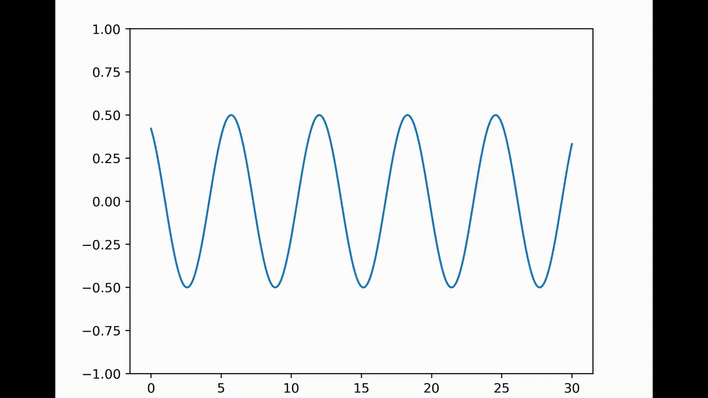

```python
from manim import *
import matplotlib.pyplot as plt


def get_image(image_name):
    img = ImageMobject(image_name).scale(4.5)
    return img


def my_function(amplitude, omega, t, k, x):
    return amplitude * np.sin(omega * t - k * x)


def get_image_plot(amplitude, omega, t, k, x):
    plt.cla()
    plt.rcParams['figure.dpi'] = 400
    plt.ylim(-1, 1)
    plt.plot(x, my_function(amplitude, omega, t, k, x))
    plt.savefig("tmp.png", dpi=400)
    img = get_image("tmp.png")
    return img


class ConnectingMatplotlib(Scene):
    def construct(self):
        x_values = np.linspace(0, 30, 400)

        amp1 = 0.5
        amp2 = 1
        tr_amplitude = ValueTracker(amp1)

        k1 = 1
        k2 = 1.3
        tr_k = ValueTracker(k1)

        t1 = 1
        t2 = 2
        tr_time = ValueTracker(t1)

        omega1 = 1
        omega2 = 2.5
        track_omega = ValueTracker(omega1)

        image = get_image_plot(amp1, omega1, t1, k1, x_values)
        self.add(image)

        def update_image(mob):
            new_mob = get_image_plot(
                tr_amplitude.get_value(),
                track_omega.get_value(),
                tr_time.get_value(),
                tr_k.get_value(),
                x_values
            )
            mob.become(new_mob)

        image.add_updater(update_image)

        self.play(tr_time.set_value, t2)
        self.play(tr_amplitude.set_value, amp2, run_time=3)
        self.play(tr_k.set_value, k2, run_time=2, rate_func=there_and_back)

```

