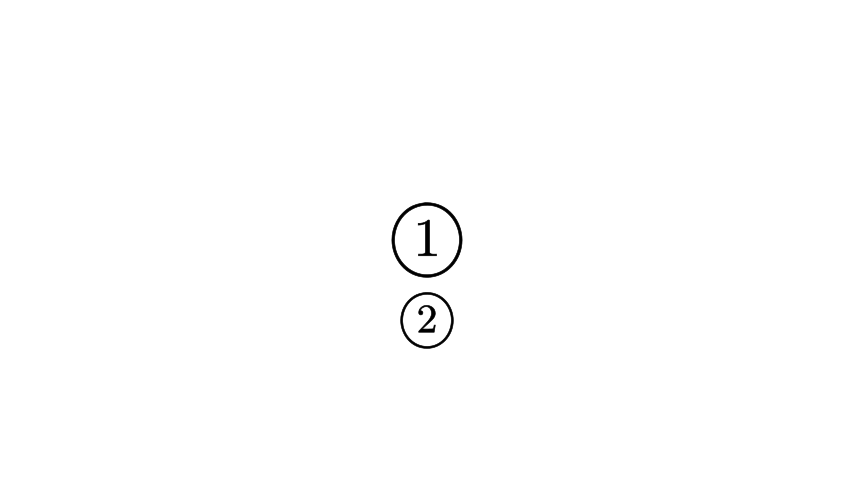
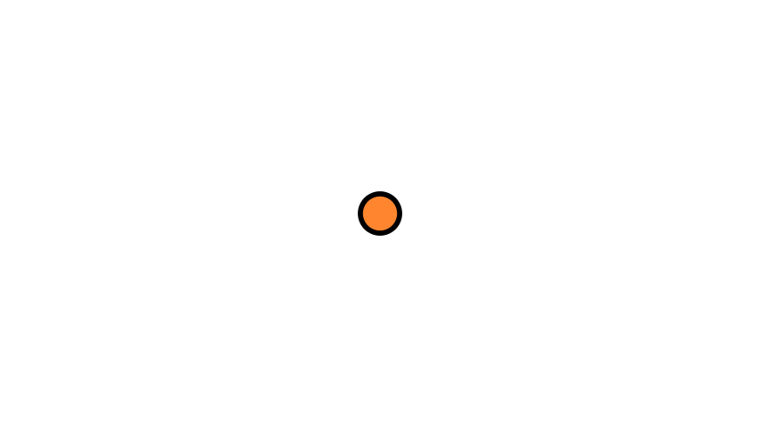

```python
class Annotate1(Scene):
    def construct(self):
        num1 = TexMobject(r"{\large \textcircled{\small 1}} ").scale(2)
        num2 = TexMobject(r"{\large \textcircled{\small 2}} ").scale(1.5)
        num2.next_to(num1,DOWN)
        self.add(num1 ,num2)
        self.wait(1)
```



```python
class Annotate2(Scene):
    def construct(self):
        sourunding_dot = Dot().scale(1.3).set_fill(color=BLACK).set_z_index(-1)
        innerdot = Dot().set_color(ORANGE)
        annotation_dot= VGroup(sourunding_dot,innerdot).scale(4)
        self.add(annotation_dot)
        self.wait()
```



```python
class Annotate3Brace(Scene):
    def construct(self):
        dot = Dot([0,0,0])
        dot2= Dot([2,1,0])
        line = Line(dot.get_center(),dot2.get_center()).set_color(ORANGE)
        b1=Brace(line)
        b1text = b1.get_text("Distance")
        b2 = Brace(line,direction= line.copy().rotate(PI/2).get_unit_vector())
        b2text = b2.get_tex("x-x_1")
        self.add(dot,dot2,line,b1,b2, b1text, b2text)
```

