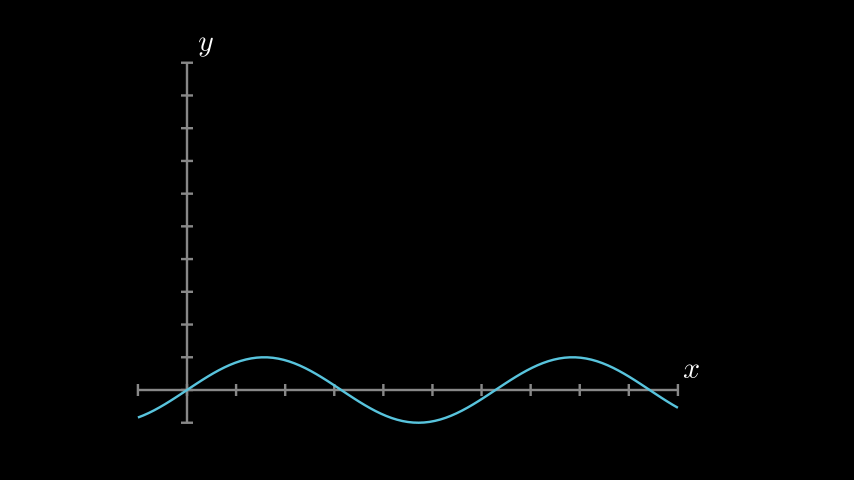
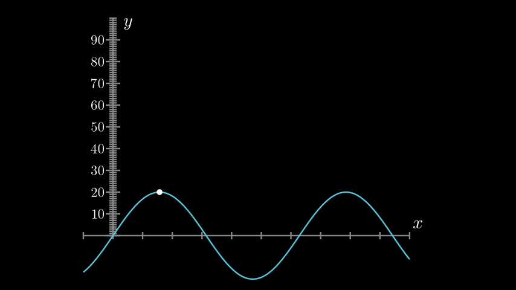
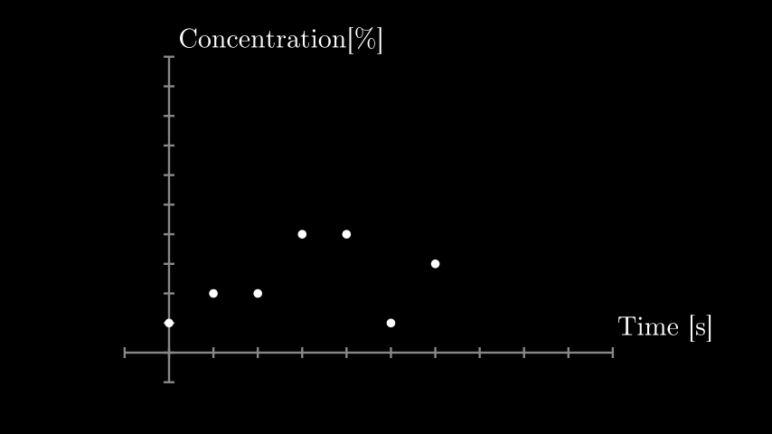
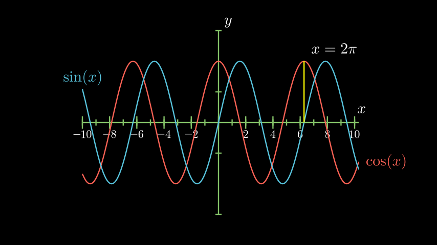

```python
class Plot1(GraphScene):
    def construct(self):
        self.setup_axes()
        my_func = lambda x: np.sin(x)
        func_graph=self.get_graph(my_func)
        self.add(func_graph)
```



```python
class Plot2yLabel(GraphScene):
    CONFIG = {
        "y_min": 0,
        "y_max": 100,
        "y_tick_frequency": 10,
        "y_labeled_nums": np.arange(0, 100, 10)
    }

    def construct(self):
        self.setup_axes(animate=True)
        dot = Dot()
        dot.move_to(self.coords_to_point(PI / 2, 20))
        my_func = lambda x: 20 * np.sin(x)
        func_graph = self.get_graph(my_func)
        self.add(func_graph)
        self.add(dot)
```


```python
class Plot3DataPoints(GraphScene):
    CONFIG = {
        "y_axis_label": r"Concentration[$\%$]",
        "x_axis_label": "Time [s]",
        }

    def construct(self):
        data = [1, 2, 2, 4, 4, 1, 3]
        self.setup_axes(animate=True)
        for time, dat in enumerate(data):
            dot = Dot().move_to(self.coords_to_point(time, dat))
            self.add(dot)
            self.wait(1)
            print(time)
        self.wait()
```



```python
class Plot4SinCos(GraphScene):
    CONFIG = {
        "x_min": -10,
        "x_max": 10.3,
        "num_graph_anchor_points": 100,
        "y_min": -1.5,
        "y_max": 1.5,
        "graph_origin": ORIGIN,
        "function_color": RED,
        "axes_color": GREEN,
        "x_labeled_nums": range(-10, 12, 2),
    }

    def construct(self):
        self.setup_axes(animate=False)

        def func_cos(x):
            return np.cos(x)

        def func_sin(x):
            return np.sin(x)

        func_graph = self.get_graph(func_cos, self.function_color)
        func_graph2 = self.get_graph(func_sin)
        vert_line = self.get_vertical_line_to_graph(TAU, func_graph, color=YELLOW)
        graph_lab = self.get_graph_label(func_graph, label="\\cos(x)")
        graph_lab2 = self.get_graph_label(func_graph2, label="\\sin(x)", x_val=-10, direction=UP / 2)
        two_pi = TexMobject("x = 2 \\pi")
        label_coord = self.input_to_graph_point(TAU, func_graph)
        two_pi.next_to(label_coord, RIGHT + UP)
        self.add(func_graph, func_graph2, vert_line, graph_lab, graph_lab2, two_pi)
```




```python
class Plot6HeatDiagram(GraphScene):
    CONFIG = {
        "y_axis_label": r"T[$^\circ C$]",
        "x_axis_label": r"$\Delta Q$",
        "y_min": -8,
        "y_max": 30,
        "x_min": 0,
        "x_max": 40,
        "y_labeled_nums": np.arange(-5, 34, 5),
        "x_labeled_nums": np.arange(0, 40, 5),

    }

    def construct(self):
        data = [20, 0, 0, -5]
        x = [0, 8, 38, 39]
        print(x)
        self.setup_axes(animate=True)
        dot_collection = VGroup()
        for time, val in enumerate(data):
            dot = Dot().move_to(self.coords_to_point(x[time], val))
            self.add(dot)
            dot_collection.add(dot)
        l1 = Line(dot_collection[0].get_center(), dot_collection[1].get_center())
        l2 = Line(dot_collection[1].get_center(), dot_collection[2].get_center())
        l3 = Line(dot_collection[2].get_center(), dot_collection[3].get_center())
        self.add(l1, l2, l3)
```


