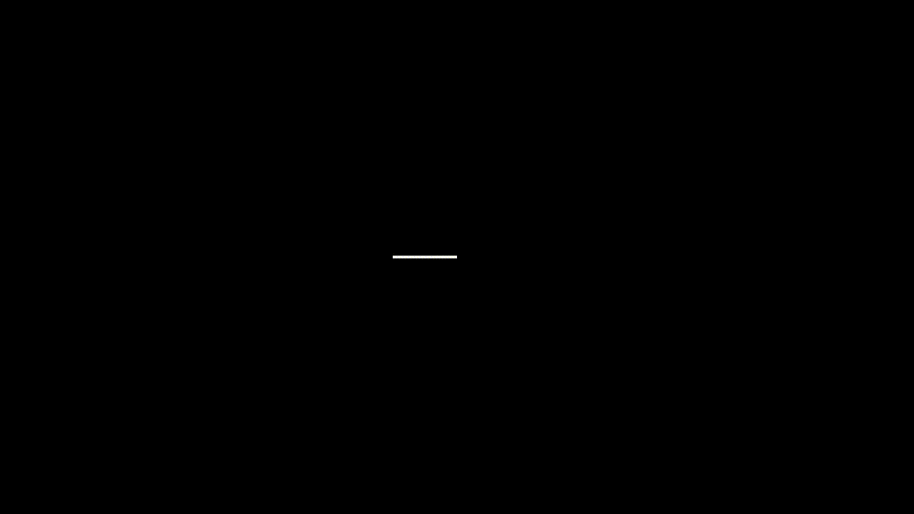
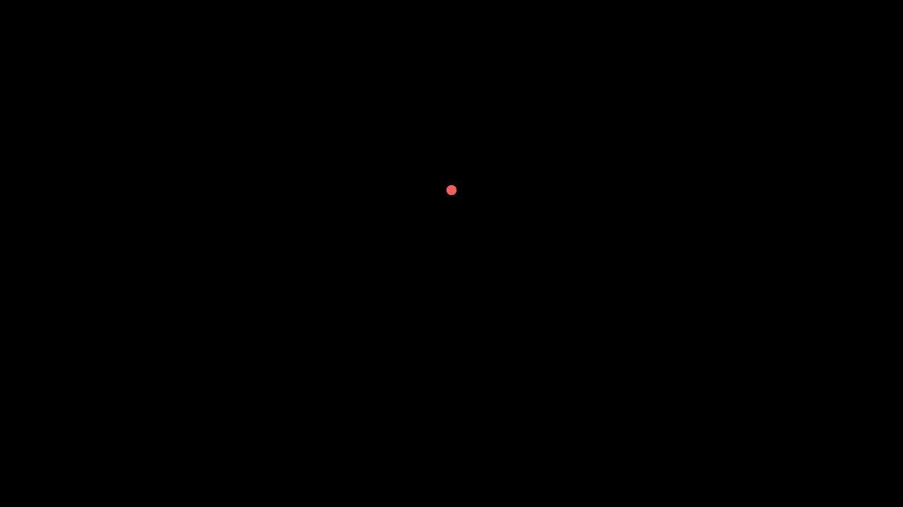
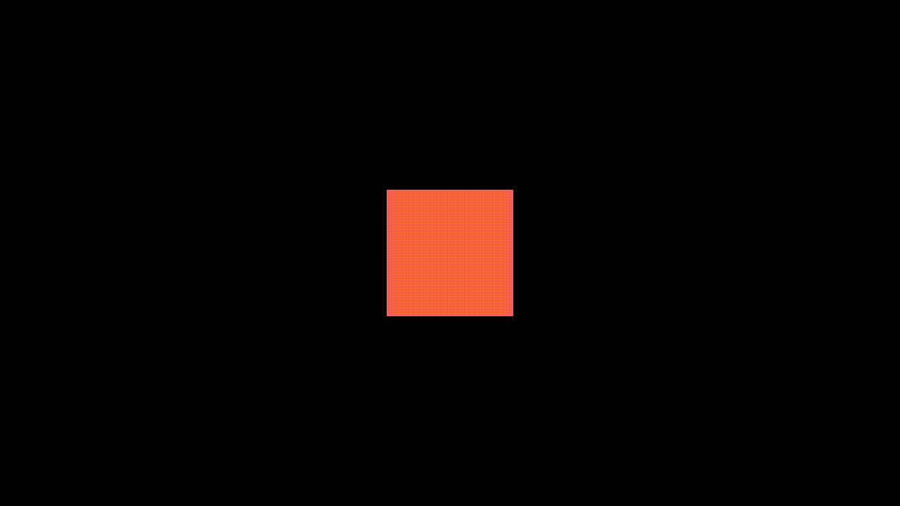

```python
class Updater1Example(Scene):
    def construct(self):
        curve_reference = Line(ORIGIN, LEFT).set_color(GREEN)
        self.add(curve_reference)

        def update_curve(mob, dt):
            mob.rotate_about_origin(dt)

        def update_curve_back(mob, dt):
            mob.rotate_about_origin(-dt)

        curve2 = Line(ORIGIN, LEFT)
        curve2.add_updater(update_curve)
        self.add(curve_reference, curve2)
        self.wait(PI / 2)

        curve2.remove_updater(update_curve)
        curve2.add_updater(update_curve_back)
        self.wait(PI / 2)
```



```python
class Updater2(Scene):
    def construct(self):
        path = VMobject()
        dot = Dot()
        path.set_points_as_corners([dot.get_center(), dot.get_center()])

        def update_path(path):
            previus_path = path.copy()
            previus_path.add_points_as_corners([dot.get_center()])
            path.become(previus_path)

        path.add_updater(update_path)

        self.add(path, dot)
        self.play(Rotating(dot, radians=PI, about_point=RIGHT, run_time=2))
        self.wait()
        self.play(dot.shift, UP)
        self.play(dot.shift, LEFT)
        self.wait()
```


```python
class Updater3ValueTracker(Scene):
    def construct(self):
        dot_disp = Dot().set_color(RED)
        self.add(dot_disp)

        tick_start = 1
        tick_end = 2
        val_tracker = ValueTracker(tick_start)

        def dot_updater(mob):
            mob.set_y(val_tracker.get_value())

        dot_disp.add_updater(dot_updater)
        self.play(val_tracker.set_value, tick_end, rate_func=linear)
        self.wait()
```



```python
class Updater3Color(Scene):
    def construct(self):
        tick_start = 1.0
        tick_end = 2.0
        val_tracker = ValueTracker(tick_start)
        square = Square(fill_opacity=1).set_stroke(width=0)
        self.add(square)
        num_colors = 1000
        cols = color_gradient([RED, WHITE, BLUE], num_colors)

        def col_uptater(mob):
            integ = int((val_tracker.get_value() - tick_start) / (tick_end - tick_start) * (num_colors - 1))
            mob.set_color(cols[integ])

        square.add_updater(col_uptater)
        self.play(val_tracker.set_value, tick_end, rate_func=linear, run_time=3)
```

