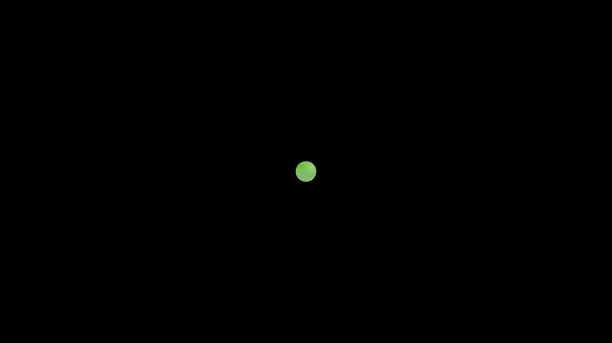
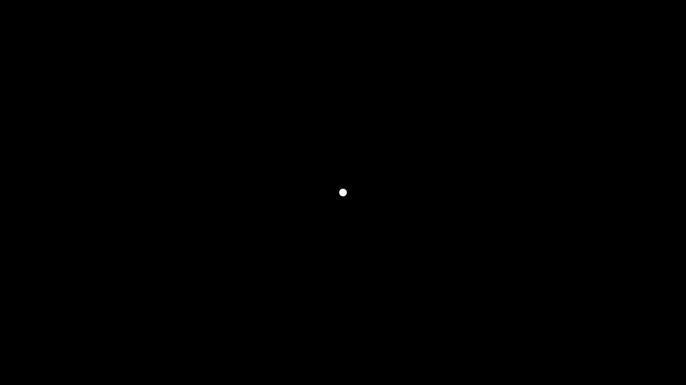
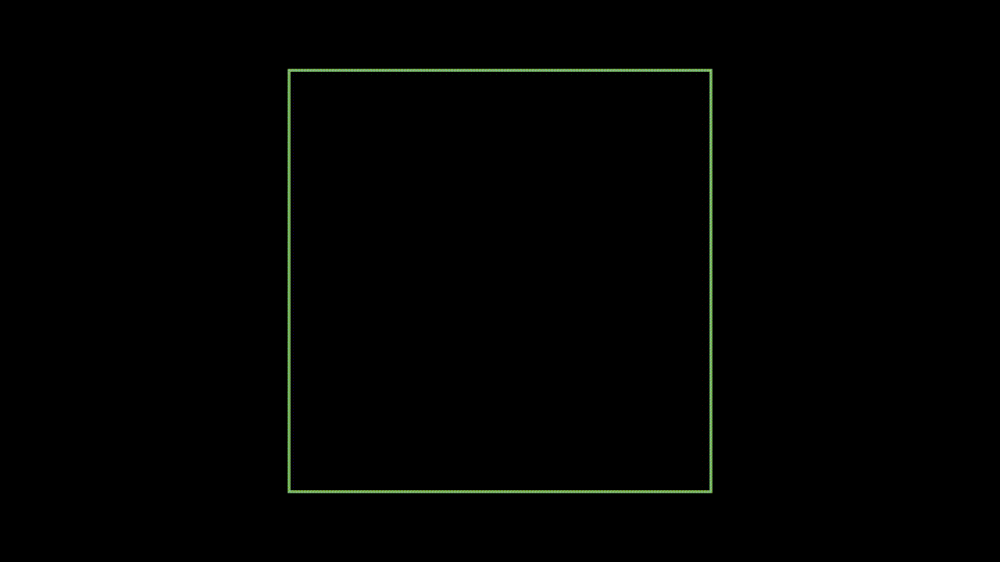

```python
class Updater1Example(Scene):
    def construct(self):
        curve_reference = Line(ORIGIN, LEFT).set_color(GREEN)
        self.add(curve_reference)

        def update_curve(mob, dt):
            mob.rotate_about_origin(dt)

        def update_curve_back(mob, dt):
            mob.rotate_about_origin(-dt)

        curve2 = Line(ORIGIN, LEFT)
        curve2.add_updater(update_curve)
        self.add(curve_reference, curve2)
        self.wait(PI / 2)

        curve2.remove_updater(update_curve)
        curve2.add_updater(update_curve_back)
        self.wait(PI / 2)
```


```python
class Updater2(Scene):
    def construct(self):
        path = VMobject()
        dot = Dot()
        path.set_points_as_corners([dot.get_center(), dot.get_center()])

        def update_path(path):
            previus_path = path.copy()
            previus_path.add_points_as_corners([dot.get_center()])
            path.become(previus_path)

        path.add_updater(update_path)

        self.add(path, dot)
        self.play(Rotating(dot, radians=PI, about_point=RIGHT, run_time=2))
        self.wait()
        self.play(dot.shift, UP)
        self.play(dot.shift, LEFT)
        self.wait()
```


```python
class Updater3ValueTracker(Scene):
    def construct(self):
        dot_disp = Dot().set_color(RED)
        self.add(dot_disp)

        tick_start = 1
        tick_end = 2
        val_tracker = ValueTracker(tick_start)

        def dot_updater(mob):
            mob.set_y(val_tracker.get_value())

        dot_disp.add_updater(dot_updater)
        self.play(val_tracker.set_value, tick_end, rate_func=linear)
        self.wait()
```


```python
class Updater3Color(Scene):
    def construct(self):
        tick_start = 1.0
        tick_end = 2.0
        val_tracker = ValueTracker(tick_start)
        square = Square(fill_opacity=1).set_stroke(width=0)
        self.add(square)
        num_colors = 1000
        cols = color_gradient([RED, WHITE, BLUE], num_colors)

        def col_uptater(mob):
            integ = int((val_tracker.get_value() - tick_start) / (tick_end - tick_start) * (num_colors - 1))
            mob.set_color(cols[integ])

        square.add_updater(col_uptater)
        self.play(val_tracker.set_value, tick_end, rate_func=linear, run_time=3)
```


```python
class Updater4AddUpdater(Scene):
    def construct(self):
        dot = Dot()

        def func(t):
            return np.array((np.sin(2 * t), np.sin(3 * t), 0))

        func = ParametricFunction(func, t_max=TAU, fill_opacity=0)
        func.scale(2)
        new_func = CurvesAsSubmobjects(func)
        new_func.set_color_by_gradient(BLUE, RED)
        dot.add_updater(lambda m: m.move_to(func.get_end()))
        func.fade(1)
        self.add(dot)
        self.play(ShowCreation(new_func), run_time=5)
        self.wait()

```


```python
class Updater5FromFunc(Scene):
    def construct(self):
        run_setting = {"run_time": 1, "rate_func": linear}
        tick_start = 0
        tick_end = 100
        val_tracker= ValueTracker(tick_start)
        dot_disp= Dot().scale(3).set_color(GREEN)
        self.add(dot_disp)
        def Tiny_Updater(dots,val_trackerX):
            def small_change2(mob):
                mob.move_to(DOWN * 0.01 * val_trackerX.get_value())
                print(val_trackerX.get_value())
                return mob
            return UpdateFromFunc(dots, small_change2)
```




```python
class Updater6FromFunc(Scene): #Two Options to update a scene one more nested, one more explicit
    def construct(self):
        tick_start=0
        tick_end=100
        val_tracker= ValueTracker(tick_start)
        dot_disp= Dot()
        self.add(dot_disp)
        # version A
        def small_change(dot_disp,val_tracker):
            dot_disp.shift(UP * 0.001 * val_tracker.get_value())
            print(dot_disp.get_center()[1])
            return dot_disp
        self.play(
            UpdateFromFunc(
                dot_disp,
                lambda mob: mob.become(small_change(dot_disp,val_tracker))),
            val_tracker.set_value,tick_end, rate_func= linear
        )
        #  version B
        val_tracker= ValueTracker(tick_start)
        def Tiny_Updater(dots,val_trackerX):
            def small_change2(mob):
                mob.shift(DOWN * 0.001 * val_trackerX.get_value())
                return mob
            return UpdateFromFunc(dots, small_change2)
        self.play(Tiny_Updater(dot_disp,val_tracker),val_tracker.set_value,tick_end)
        self.wait()
```




```python
class Updater7Ball_dt(Circle):
    CONFIG = {
        "radius": 0.4,
        "fill_color": BLUE,
        "fill_opacity": 1,
        "color": BLUE
    }

    def __init__(self, ** kwargs):
        Circle.__init__(self, ** kwargs)
        self.velocity = np.array((2, 0, 0))

    def get_top(self):
        return self.get_center()[1] + self.radius

    def get_bottom(self):
        return self.get_center()[1] - self.radius

    def get_right_edge(self):
        return self.get_center()[0] + self.radius

    def get_left_edge(self):
        return self.get_center()[0] - self.radius

class Box(Rectangle):
    CONFIG = {
        "height": 6,
        "width": 6,
        "color": GREEN_C
    }

    def __init__(self, ** kwargs):
        Rectangle.__init__(self, ** kwargs)  # Edges
        self.top = 0.5 * self.height
        self.bottom = -0.5 * self.height
        self.right_edge = 0.5 * self.width
        self.left_edge = -0.5 * self.width

class BouncingBall(Scene):
    def construct(self):
        box = Box()
        ball = Ball()
        self.add(box)
        self.play(FadeIn(ball))

        def update_ball(ball,dt):
            ball.acceleration = np.array((0, -7, 0))
            ball.velocity = ball.velocity + ball.acceleration * dt
            ball.shift(ball.velocity * dt)  # Bounce off ground and roof
            if ball.get_bottom() <= box.bottom or \
                    ball.get_top() >= box.top:
                ball.velocity[1] = -ball.velocity[1]
            # Bounce off walls
            if ball.get_left_edge() <= box.left_edge or \
                    ball.get_right_edge() >= box.right_edge:
                ball.velocity[0] = -ball.velocity[0]

        ball.add_updater(update_ball)
        self.add(ball)

        self.wait(7)

```

