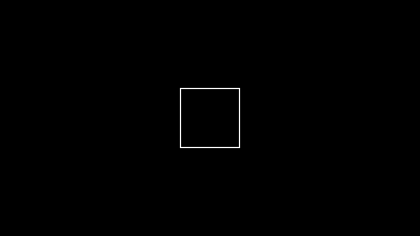
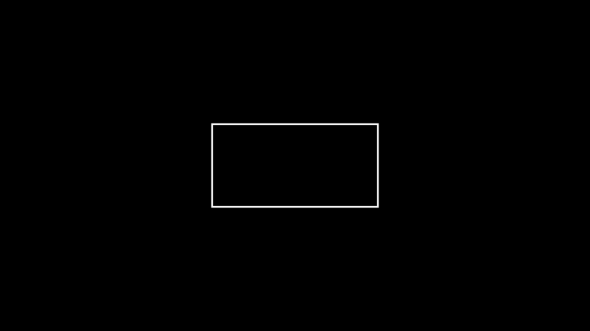

## Shapes & Geometrie
```python
class ShapeExample1(Scene):
    def construct(self):
        dot = Dot()
        self.add(dot)
```


```python
class ShapeExample2(Scene):
    def construct(self):
        circ = Circle()
        self.add(circ)
```


```python
class ShapeExample3(Scene):
    def construct(self):
        sq = Square()
        self.add(sq)
```


```python
class ShapeExample4(Scene):
    def construct(self):
        rect = Rectangle(height=2, width=4)
        self.add(rect)
```

